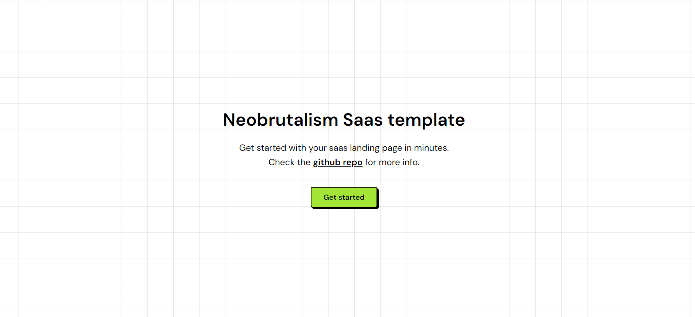

# Saas

Saas is a neobrutalism-styled nextjs tailwind template for saas landing pages.

## Get started

[Create a new repo](https://github.com/neobrutalism-templates/saas/generate) from this template.

### Installation

This template uses `pnpm` package manager so make sure you have it installed.

To install all dependencies run:

```bash
pnpm i
```

To run the app locally:

```bash
pnpm run dev
```

### Config

- Inside `layout.tsx` update the metadata
- Update the `favicon.ico`
- Inside `page.tsx` update the content

### Sections

All content is split into sections so you can edit it more easily.

### Styling

To change the styling visit [styling docs](https://neobrutalism-components.vercel.app/docs/styling), and copy the desired styling to tailwind config like it's shown in the styling docs.
